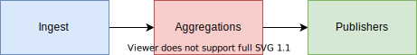
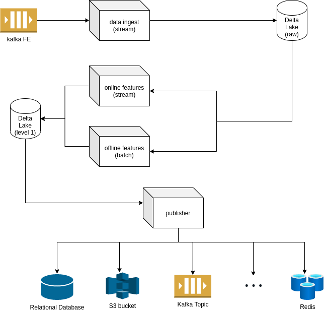
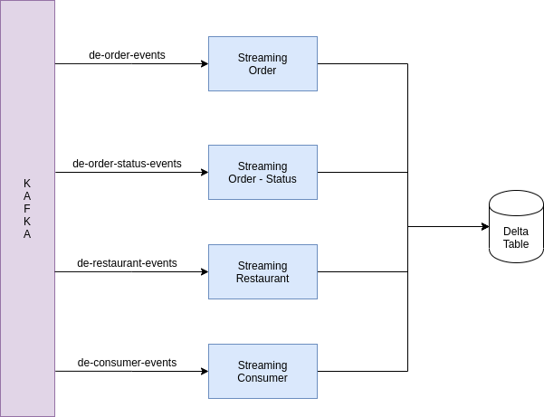

# ML-Engineer - IFood

# Introduction

The goal of this project is to build a platform to create, store, and serve features for machine learning algorithms and business intelligence tools. For that, we used Spark as our main tool for processing data. It supports batch and stream pipelines, which are key features to build more reliable, scalable projects. Besides that, Spark is a swiss army knife (check this term, maybe you need a more formal one) framework that offers a complete and well-established solution for distributed computing.

# Feature Store

Feature store allows teams to share, discover, and use a highly curated set of features for their machine learning problems. 

## Project

The project is structured in three parts, Ingest, Aggregations, and Publishers. Image 1 depicts the flow of these three parts.

A brief description of each part is presented below:

- **Ingest**: The ingest is responsible for receiving the data from external sources and persist it in permanent storage, Also, it is responsible for the first parser of the data since, from some sources, the data can come in a binary format, so saving it in a more digestible format, like *parquet* or *delta*.
- **Aggregations:** The aggregation step is responsible to group and aggregates the data based on a key and a time. This step can be divided into two types, *online aggregations,* and *offline aggregations. Offline aggregations* produce offline features, that are calculated as part of a batch job. Given their nature, creating these types of features can take time, example the average monthly spent. On the other end, online aggregations are more complex as they need to be calculated very fast and are often served in millisecond latency.
- **Publishers:**  The data generated by aggregations is not always ready to be consumed by applications. If a machine learning model wants to access the last features from a  particular key, it is expensive to read from formats like parquet and delta (common spark formats), but it is easy to read a relational database or a key/value database. The idea of this step is to save the data in several formats and let each application that consumes data from the feature store choose which is the best alternative. Since we're using spark as our main tool, it has several connectors to either, read and write data.

## Architecture

To explain the project’s architecture in details, we expanded Image 1  into a deeper level, which is expressed by the following diagram on Image 2:

 

## Data Ingest

Data may come from countless sources. To centralize those sources we can provide services to receive and collect the data, like REST API to receive the events, routines to collect from external databases, etc. This part can be very complex, and the user has to understand where are your data and how to read it. 

This project already assumes that part of the ingestion is already built and the data is into a Kafka topic. In this part, we read data from Kafka and save it into a delta table. For each type of source, we have a streaming running to load, parse, and save the data. 

Each Kafka topic has a separately streaming running. 

All ingestion jobs are Structured Streaming. They read a specific Kafka topic, parse the data based on a schema, and save it into the `delta lake`. 

The following parameters are used to configure the job:

| Parameter     | Description                                                                                            | Default                   |
|---------------|--------------------------------------------------------------------------------------------------------|---------------------------|
| app-name      | The application name                                                                                   | feature-store-data-ingest |
| master-mode   | The master URL for the cluster. See Master URL docs                                                    | local[*]                  |
| kafka-brokers | Kafka address                                                                                          |                           |
| kafka-topics  | Kafka Topics                                                                                           |                           |
| data-dir      | Output data directory                                                                                  |                           |
| stream-type   | Streaming type. Available are: order-events, order-status-event, restaurant-events and consumer-events |                           |
| Parameter     | Description                                         | Default                         |

All data are partitioned by `year`, `month`, `day`. At first moment, it only accepts those fields but it can be easily added in the next versions. The data field used to generate the partition filters are configured inside each parser type.

## Aggregations

The most important and complex part is aggregation. It is responsible for group and aggregates the data based on rules. The problem is the countless types of aggregations users need. Since simple ones like `sum`, `min`, `max`, `avg`, `mean`, until complex like calculating the `user session time` when interacting with a web site. All these aggregations are executed over a time window.

To process mostly aggregations types, we have two types of aggregations:

- **Batch precompute.** The first type of computing is to conduct bulk precomputing and loading historical data. This is efficient and generally works well for historical features where it is acceptable for the features to only be updated every few hours or once a day.
- **Near-real-time compute.** The second type is to generate aggregate features at low latency. Near real-time aggregations are used to calculate features that need to be served faster.

 

Thinking in those two types, we have two types of aggregators, the first we named *Offline Feature*, that are batch jobs that usually calculates d-1 features, or over large time windows, like the average of a value in the last 30 days. The second one is named *Online Features* that are used to calculate near-real-time features, over a specific time window, like 30 minutes or 1 hour. In the following topics, these two types will be explained in detail.

### Offline Features

To process offline features we use Spark batch over a specific time window to calculate the aggregations. The kinds of aggregations are limited to [spark functions](https://spark.apache.org/docs/latest/sql-ref-functions-builtin.html#aggregate-functions). And for each aggregation, you can determine a sub-window to calculate the feature. For instance, the general time window is the last 30 days of data, so you can calculate your feature based on a period of time passing a parameter to the aggregation function.

Each job can execute aggregations over a unique data source, and load data from a start date and end-date (passed throw job parameters). Inside the job, you can set the sub-window using the `period` parameter of `AgActions`.
The job parameters are:

| Parameter     | Description                                         | Default                         |
|---------------|-----------------------------------------------------|---------------------------------|
| app-name      | The application name                                | feature-store-data-aggregations |
| master-mode   | The master URL for the cluster. See Master URL docs | local[*]                        |
| kafka-brokers | Kafka address                                       |                                 |
| kafka-topics  | Kafka Topics                                        |                                 |
| input-table   | Path to input table                                 |                                 |
| output-table  | Path to output table                                |                                 |
| agg-field     | Field to be used as group by key                    |                                 |
| time-field    | Field to be used as time filter                     |                                 |
| start-date    | Start date: Ex. 2019-12-05                          |                                 |
| end-date      | End date: Ex. 2020-12-05                            |                                 |

When started, the job will read data from `input-table` filtered by (`time-field` >`start-date`) and (`time-field` < `end-date`) and will group by `group-field`. After that, it will apply all configured aggregations. 

Today those aggregations can be one of these two types:

- **AggAction**: This type is easier to configure but is limited to [spark aggregate functions](https://spark.apache.org/docs/latest/sql-ref-functions-builtin.html#aggregate-functions), like `sum` , `avg`, `mean`, etc. The definition of this type are:

| Field       | Description                                     |
|-------------|-------------------------------------------------|
| featureName | Name of the output feature. Ex `order-count-1d` |
| period      | Is the sub-window parameter. Ex: 3 days, 5 days |
| field       | Field name that the agg will be applied         |
| operation   | Type of aggregation.                            |

- **AggCustomAction**: This type is more generic, but it has a more complex implementation since you have to write the entire expression in a string to be evaluated by the spark.

| Field       | Description                                     |
|-------------|-------------------------------------------------|
| featureName | Name of the output feature. Ex `order-count-1d` |
| operation   | Type of aggregation.                            |

### Online Features

To process Online Features we are using structured streaming and processing over a window with a slide duration. Different from the offline features, in the online the window is fixed per streaming. In other words, for each source and time window we have different streaming.

| Parameter             | Description                                                                             | Default             |
|-----------------------|-----------------------------------------------------------------------------------------|---------------------|
| app-name              | The application name                                                                    | feature-store-data- |
| aggregations          | The aggregation expresed in SQL using `expr` function.                                  |                     |
| master-mode           | The master URL for the cluster. See Master URL docs                                     | local[*]            |
| kafka-brokers         | Kafka address                                                                           |                     |
| kafka-topics          | Kafka Topics                                                                            |                     |
| input-table           | Path to input table                                                                     |                     |
| output-table          | Path to output table                                                                    |                     |
| watermark             | Watermark allows us to drop old states and deal with old data                           |                     |
| time-field            | Field to be used as time filter                                                         |                     |
| agg-field             | Field to be used as group by key                                                        |                     |
| window-duration       | The size of the time window used in each aggregation                                    |                     |
| window-slide-duration | The time between two aggregations, if smaller than window-duration, we have an overlap. |                     |

To express the features, we use the same objects of Offline Aggregations, `AggAction` and `AggCustomAction`.  But in the case of `AggAction` the field `period` is ignored. 

This approach gives us a certain facility to express our aggregations, based only on configurations. But it also brings some limitations to our expressions. 

# Publisher

The publishers are jobs that can save in multiples destinations like Kafka, relational database, key/value database, etc. Data in `delta` format is not easy to read for all applications, so the idea is to be able to save it in different formats is very important. 

For example, think in the scenario where we have to read from a Redis database, the Spark integration exists but is limited, so we could put the data into a Kafka topic and consume it using an application in Go to consumes and write in a specific format into a Redis database that is consumed by models in a production environment. Or we could simply use a publisher to send the data to less expensive storage like S3 or other-like.  

| Parameter      | Description                                         | Default  |
|----------------|-----------------------------------------------------|----------|
| master-mode    | The master URL for the cluster. See Master URL docs | local[*] |
| app-name       | Application name                                    |          |
| publisher-type | Publisher Type. Available: historical               |          |
| input-table    | Input table path                                    |          |
| output-table   | Ouput table path                                    |          |

The publisher could be in batches, for a specific proposals, or stream to online features. The aggregations are been saving in `delta` format, which allows us to build both kinds of models.

# Future work

- Improve usage. Create a friendly SDK to build rules.
- Chain of aggregations and joins for offline aggregation
- Create an API to serve features from a more digestible source.
- Improve Publisher to be able to join features sources.
- Partition filters. Today the data is been saved with a default partitioning (year, month and day). But to read, it's not using the partitioning. Performance could be improved using a partition filter when reading data.
- Use a pipeline manager like AirFlow, Azkaban or Dagster, for example.
- Compound features. Spark allows control states using functions like `flatMapGroupWithState`, it could be used to generate more complex aggregations.
- Consume from other sources, example a data lake.
- Create namespaces for the features, to allow multiples teams to create features with the same name, but different contexts.
- Integrate with data catalog, to make it easier to all in the organization find the available features.
- Run administrative routines periodically, like delta vacuum and optimizer.

# Problems along the road

- Compound features. I've tried to create more complex features using the `flatMapGroupWitState` function, but control manually the spark states is very tricky. So for the initial version, I left this functionality behind.
- Multi-time window in batch aggregations. Read multiple times a dataset is expensive, so create a small window, with the `when` clause in the query, works. But it's a threshold between how much data you will load and the granularity of your aggregations. Always read the entire dataset to perform into small windows is not performative.
- One of the ideas was to create a publisher to MySQL database. But I had problems to run a docker with MySQL without proper configurations. So the spark could access the database due to authentication protocol problems.

# How to Run

To run the project, the steps to compiling the project and build the docker were defined in the make file. To execute it run `make build-all`. This command will build the `.jar` and the docker. It also will create a tag called `spark3docker` that can be executed using `make docker-run`.

To be easier to run an example, inside the docker has a script called `[run-all.sh](http://run-all.sh)` that starts progressively the streamings, and after 3 minutes, starts the *Offline Aggregation.* The script runs the following spark-submits:

- Start the ingest, class DataIngestionStreamMain.
- Start the Aggregation online, class AggregationsOnlineMain.
- Start the Aggregation offline, class AggregationsOfflineMain
- Start the publisher, class PublisherMain.

In the example, all the data is been saving into `/tmp/ifood` directory. To read it, the user can use a spark-shell with delta dependency `spark-shell --packages "io.delta:delta-core_2.12:0.7.0"`. Alternatively, users can use the Jupyter notebook that is available at the address: `localhost:8888` where the data can be read in `parquet` format.

To stop all streamings, run `stop-all.sh`.

# Conclusion

The platform still has usability gaps, but it is the first version. Despite that, the idea is to centralize the creation, processing, and consumption of features in one single place and share it across the organization. 

And if we assume that the majority of features are not exactly complex, they are sums and averages of fields, the platform became very reliable in a production environment, where you have lots of models and applications consuming simple aggregations from the platform.
